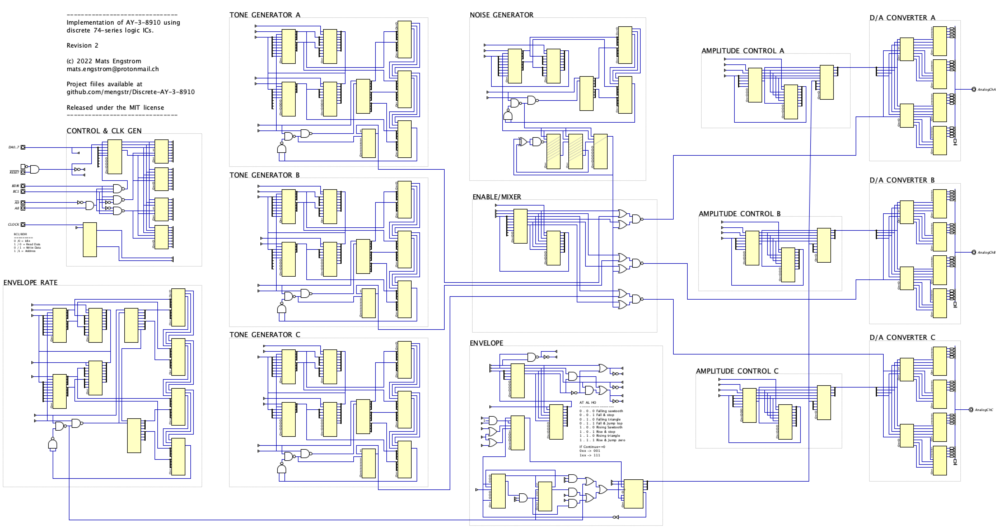

# Discrete AY-3-8910

This is a WIP project to make a complete and fully compatible AY-3-8910 out of discrete and readily avaiable 74-series logic ICs.

## Background

Whilst there are many software implementations both for PC and microcontrollers like an AVR as well as implemntations in Verilog to be used in a FPGA I haven't seen any real hardware level implementations of it yet.

The chip is fairly well analyzed and documented and even had its die analysed and a schematic of it on the transistor-level has been made. More info about that can be found github.com/lvd2/ay-3-8910_reverse_engineered

## Digital simulation

Being a fan of Helmut Hneemanns project _Digital_ which is a circuit simulator for digital designs (much like Logisim) I started by making a design of the AY-3-8910 using it ending up in just a bit over 104 ICs.

This sounds like a lot of ICs and also quite complicated to build, but my design is modular and most of the modules are
not too complex or hard to understand. With the exeption o the most complex module - the envelope generator that
generates the  eight different envelopes  used to vary the volume of the tones over time. 
I've split this into two separate modules, one for the rate genaration and
one for generating the actual envalope shapes.

I have a copy of the shape module as a separate module in Digtial with testcases in order to verify the correct function of each mode.

Below is a shrunk and blurry overview of the entire schematic - click here for a [highres version](https://raw.githubusercontent.com/mengstr/Discrete-AY-3-8910/main/Images/AY-3-8910-full-large.png) of it.

### Module Block diagram

The is a block diragram showing how the modules are interconnected. Since the envelope genarator is fairly complex it is split into two parts. One for generating the clock that affects the rate of the envelope and one that actually creates the 4-bit digital values of the envelope. 

The complete build is spread out on separate modules that are hooked up together using some common signals like the databus, reset and clock that are generated by the ~Control module~ and also connects separate ReadEnable and WriteEnable signals to each modules. 

The R-numbers in the boxes shows which registers that is controlling the functions in it.

Thick lines are busses of 4 or 8 bits, and the thin lines are single wires. This means that both the three tone genarator as well as the noise generator are just single 1-bit streams.

### Registers

There are 16 registers, each register can be written to and then read back. Unused bits reads back as zeros in the AY-3-8910, but in the pin compatible "almost-clone" YM2149 all bits can be written and read back even if they're not used for any chip functions.

To write to a specific register you first write the register number to special ~Address register~, then all following reads and writes will be directed to that register until the Address register is changed.

- R0 Channel A tone period - Fine (8 bit)
- R1 Channel A tone period - Coarse (4 bit)
- R2 Channel B tone period - Fine (8 bit)
- R3 Channel B tone period - Coarse (4 bit)
- R4 Channel C tone period - Fine (8 bit)
- R5 Channel C tone period - Coarse (4 bit)
- R6 Noise period (5 bit)
- R7 Enables (inverted) for I/O, Noise, Tone (8 bit)
- R8 Channel A amplitude (5 bit)
- R9 Channel B amplitude (5 bit)
- R10 Channel C amplitude (5 bit)
- R11 Envelope period - Fine (8bit)
- R12 Envelope period - Coarse (8bit)
- R13 Envelope shape (4bit)
- R14 Port A data (8bit)
- R15 Port B data (8bit)

## Modules

### Control and clock
This module handles the interface towards the MCU that is controlling the AY-3-8910. It is also generating the enable signals for the other modules as well as generating the clock/16 and clock/256 used by the modules for frequencies and timings.

It is also holding the Address register.

The complexity level of this module is very low. It's bascially nothin more than a latch and 4-to-16 decoder connected to the latch. The only slighly hart to understand aspect is the quite horrible way the designers made the BDIR, BC1 and BC2 inputs. It's a mess. But it turns out one can just ignore the BC2 (and tie it high) and still have access to all the different modes.

**The inputs are:**
- DataBus - 8 bits of bi-directional data
- Reset - clear most registers to all zeros
- Clock - An approx 50% duty clock input between 1 and 2.5MHz
- A8 - Address line 8 used as an active high Chip Enable
- A9 - Address line 8 used as an active low Chip Enable
- BDIR - Used togehther with BC1 to select chip functions (see below)
- BC1 - Used together with BDIR to select chip functions (see below)

| BDIR | BC1 | Action |
| :------: | :-----: |--------|
|0|0|Idle/Inactive|
|0|1|Read data from register|
|1|0|Write data to register|
|1|1|Write data to Address register|

**The outputs are:**
- DA0..7 - 8 bits of bi-directional data
- WrXxxxxx - Read signals to the registers in the other modules
- RdXxxxxx - Write signals to the registers in the other modules
- Clk/16 - The input clock divided by 16, used for frequency and timing generation in modules
- Clk/256 - The input clock divided by 256, used for timing generation specifically in the Envelope module
- Res - Inverted reset signal to modules
- Res - Non-invertet reset signal to modules

### Tone Generator (three copies)
#### (Registers R0/R1, R2/R3, R4/R5)

The AY-3-8910 have three of these modules which each outputs a square wave at a frequency controlled by two registers (12 bits in total).

The module have a 12 bit up-counter that is reset whenever the count value is larger than the value from the combined register value.

The square wave really should be at a 50% duty cycle, but in order to at least optimize the chip count a bit the 7474 "divide-by-two" IC is moved to the Mixer module, saving one full IC since each 7474 contains two separate dividers. But since the savings is so small I might move them back to the Tone Module if there's space enough on them. 

Since the 744040 counter used here is a Ripple Carry counter the outputs of them will not change synchronously the output of the Magnitude Comparators is ANDed with the incoming clock to not reset the counter until the second phase of the clock when all the bits have settled.

**The inputs are:**
- DA0..7 - 8 bits of bi-directional data
- Reset - Clear register and counter to zero
- CLK/16 - The master clock divided by 16 
- WrToneX-Fine - Latches the least sigificant 8 bits of data
- WrToneX-Coarse - Latches the most significate 4 bit of data
- RdToneX-Fine - Enables read-back of the least sigificant 8 bits of data
- RdToneX-Coarse - Enables read-back of the most significate 4 bit of data

All signals are received from the Control & Clock module

**The outputs are:**
- Out - the generated square wave send to the Mixer module

